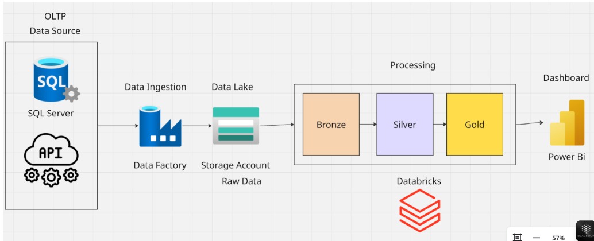

# 📊 Data Analysis – Databricks & PySpark

## 🌟 Project Overview  
This project showcases an end-to-end **Data Engineering and Analytics workflow** using **Azure Databricks**, **Azure Data Lake**, **Azure Data Factory**, and **Power BI**.  
The goal is to build a complete pipeline from raw data ingestion to insightful dashboard visualizations using the **Bronze–Silver–Gold architecture**.

---

## ☁️ Data Pipeline Architecture  

The diagram below represents the data flow from source systems to the final Power BI dashboard.

- **Data Source (OLTP / SQL Server / APIs):** Raw data collected from transactional systems.  
- **Data Factory:** Handles ingestion and movement of data into Azure Data Lake.  
- **Data Lake (Raw Storage):** Stores unprocessed data in the Bronze layer.  
- **Databricks (Processing):** Uses **PySpark** to clean, transform, and enrich data through the Bronze → Silver → Gold layers.  
- **Power BI:** Connects to the Gold layer to visualize insights interactively.

---

## 💻 Databricks & PySpark  
Data transformation was done in **Azure Databricks** using **PySpark** scripts.  
Each script creates one Gold table that’s ready for business reporting.

Scripts included:
- `Gold_Transactions.py` → Aggregates and cleans transactional data.  
- `Gold_Customers.py` → Builds customer profiles and loyalty measures.  
- `Gold_Stores.py` → Generates store-level KPIs.  
- `Gold_Products.py` → Adds product details and profitability metrics.  
- `Gold_Summary.py` → Combines all cleaned data into a unified summary.

---

## 📈 Power BI Dashboard  

The **Power BI dashboard** visualizes the final Gold datasets.  
It includes interactive pages for:
- Transactions performance  
- Customer behavior  
- Store comparisons  
- Product insights  
- Overall business summary  

---

## 🚀 Steps to Reproduce  

1. Load your raw data to **Azure SQL Server** or another OLTP source.  
2. Create pipelines in **Azure Data Factory** to move data to the **Azure Data Lake**.  
3. Open **Azure Databricks** and execute transformation scripts in `/Databricks_Scripts/`.  
4. Save the Gold layer output to **Azure SQL Warehouse** or **Synapse**.  
5. Open **Power BI Desktop**, connect to the Gold data, and open `Dashboard.pbix`.  

---

## 💡 Key Insights  
- Comprehensive end-to-end Azure data workflow.  
- Automated data cleansing and enrichment using PySpark.  
- Interactive and business-focused Power BI visualizations.  
- Scalable architecture supporting future data expansion.  

---

## 👩‍💻 Author  
**Doaa Abdelsattar**  
📍 Azure Data Engineering Student  

> Complete Azure-based data analytics pipeline built using Databricks, PySpark, and Power BI to deliver interactive insights.

